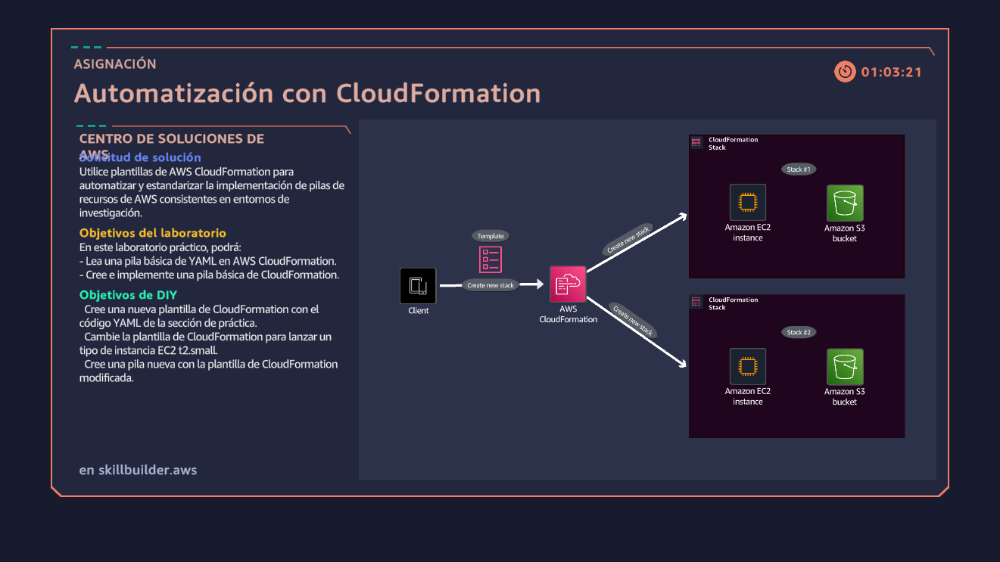
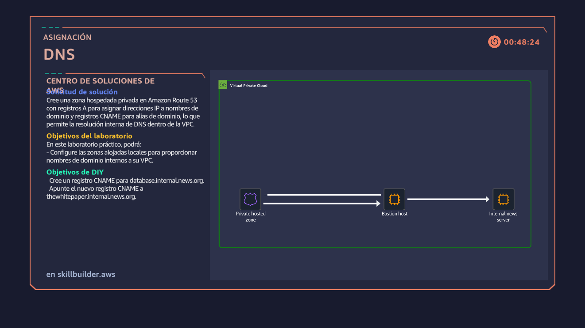
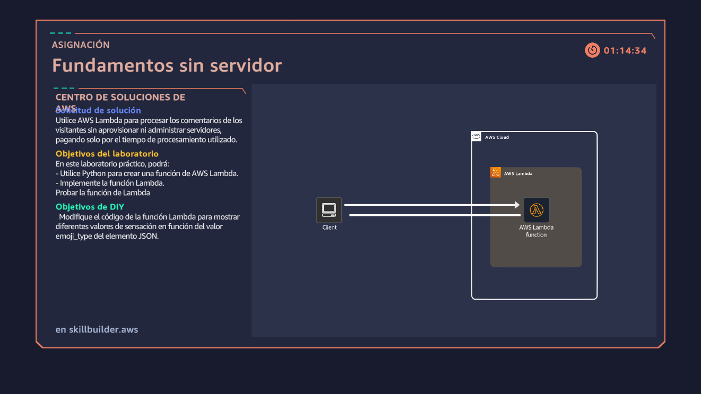
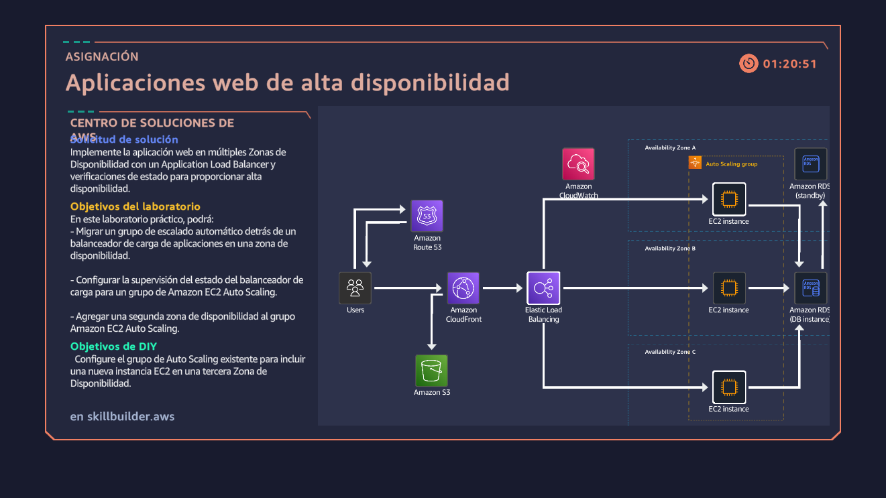

# Ruta Architecting - AWS Solutions Associate

Este repositorio contiene los laboratorios prácticos para la ruta de certificación de AWS Solutions Architect Associate. A través de estos ejercicios, aprenderás a implementar soluciones arquitectónicas en la nube de AWS, desde servicios serverless hasta arquitecturas de alta disponibilidad.

## Resumen

Los laboratorios están diseñados para proporcionarte experiencia práctica con los servicios más importantes de AWS, incluyendo:

- **Serverless**: Implementación de funciones Lambda y API Gateway
- **Infraestructura como Código**: Automatización con CloudFormation
- **Redes**: Configuración de DNS privado con Route 53
- **Alta Disponibilidad**: Balanceadores de carga, Auto Scaling y múltiples AZs

Cada laboratorio incluye un caso de uso real, diagramas de arquitectura y pasos detallados para implementar la solución.

## Índice

1. [Laboratorio API Restful](#laboratorio-api-restful)
2. [Laboratorio Automatización CloudFormation](#laboratorio-automatizacion-cloudformation)
3. [Laboratorio DNS con Route 53](#laboratorio-dns)
4. [Laboratorio Fundamentos Serverless](#laboratorio-fundamentos-serverless)
5. [Laboratorio Alta Disponibilidad Web](#laboratorio-alta-disponibilidad-web)
6. [Requisitos del Workshop](#requisitos-del-workshop)

---

## Laboratorios

### Laboratorio API Restful

**Caso de uso**: Aplicación para un parque de diversiones que permite a los clientes rentar y ubicar scooters eléctricos dentro del parque.

**Descripción**: Este laboratorio cubre la implementación de una API RESTful utilizando Amazon API Gateway y AWS Lambda. Conectas el frontend (interfaz de usuario) con el backend (base de datos) mediante integración proxy de Lambda.

**Conceptos clave**:
- API RESTful y sus principios arquitectónicos
- Amazon API Gateway como puerta de entrada gestionada
- Integración proxy de Lambda
- Stages y control de versiones de API

**Servicios AWS**: API Gateway, Lambda, DynamoDB/RDS

---

### Laboratorio Automatización CloudFormation

**Caso de uso**: Automatización del aprovisionamiento de infraestructura creando stacks de recursos de AWS de forma repetible y controlada por versiones.

**Descripción**: Aprende a modelar y aprovisionar recursos de AWS utilizando plantillas de CloudFormation en formato YAML o JSON. Creas una EC2, un grupo de seguridad y un bucket S3 de forma automatizada.

**Conceptos clave**:
- Infraestructura como Código (IaC)
- Plantillas de CloudFormation (YAML/JSON)
- Recursos de AWS: EC2, Security Groups, S3
- Referencias entre recursos con !Ref

**Servicios AWS**: CloudFormation, EC2, S3, Security Groups

**Imagen de referencia**:

---

### Laboratorio DNS

**Caso de uso**: Servidor interno de noticias para empleados de una empresa, accesible solo mediante nombres de dominio privados dentro de la VPC.

**Descripción**: Configura una zona hospedada privada en Amazon Route 53 para resolver nombres de dominio internos. Creas registros A y CNAME para Mapear IPs a nombres legibles.

**Conceptos clave**:
- Amazon Route 53 y zonas hospedadas privadas
- Registros DNS tipo A y CNAME
- Servidores Bastion (Jump Host)
- Resolución DNS interna dentro de VPC

**Servicios AWS**: Route 53, EC2, VPC

**Imagen de referencia**:

---

### Laboratorio Fundamentos Serverless

**Caso de uso**: Sistema de recopilación de comentarios y calificaciones de visitantes de un parque de diversiones, sin necesidad de gestionar servidores.

**Descripción**: Implementa una función Lambda que procesa comentarios de clientes. Aprende sobre el paradigma serverless y los servicios adicionales de la plataforma AWS serverless.

**Conceptos clave**:
- AWS Lambda y funciones serverless
- Triggers y tipos de invocación (síncrona/asíncrona)
- Plataforma serverless AWS (S3, DynamoDB, API Gateway, SNS, SQS)
- CloudWatch para logs y monitoreo

**Servicios AWS**: Lambda, CloudWatch, S3, DynamoDB, API Gateway

**Imagen de referencia**:

---

### Laboratorio Alta Disponibilidad Web

**Caso de uso**: Aplicación web de agencia de viajes desplegada en múltiples zonas de disponibilidad con balanceo de carga y auto escalado.

**Descripción**: Configura una arquitectura de alta disponibilidad utilizando Application Load Balancer, Auto Scaling Groups y verificaciones de estado. La app se despliega en múltiples AZs para garantizar redundancia.

**Conceptos clave**:
- Amazon Application Load Balancer (ALB)
- Auto Scaling Groups
- Health checks y verificación de estado
- Múltiples Zonas de Disponibilidad (AZ)
- Amazon CloudFront para CDN

**Servicios AWS**: ELB/ALB, Auto Scaling, EC2, CloudWatch, CloudFront

**Imagen de referencia**:

---

## Requisitos del Workshop

Para completar estos laboratorios, necesitarás configurar tu entorno de desarrollo. Elige una de las siguientes opciones:

### Opción 1: Consola AWS (Recomendado para principiantes)
- Una cuenta de AWS activa
- Acceso a la consola de gestión de AWS
- Permisos suficientes para crear recursos (EC2, Lambda, API Gateway, etc.)

### Opción 2: Entorno de Desarrollo Local
- **Editor de código recomendado**: VS Code
- **AWS CLI** instalado y configurado
- **AWS Toolkit** para VS Code (opcional)

### Requisitos específicos por laboratorio

| Laboratorio | Servicios requeridos |
|-------------|---------------------|
| API Restful | API Gateway, Lambda |
| CloudFormation | CloudFormation, EC2, S3 |
| DNS | Route 53, EC2, VPC |
| Serverless | Lambda, CloudWatch |
| Alta Disponibilidad | ALB, Auto Scaling, EC2 |

### Recomendaciones

1. **Cuenta AWS**: Si no tienes una, puedes crear una cuenta gratuita con el nivel gratuito de AWS (Free Tier).

2. **Región**: Se recomienda usar `us-east-1` (N. Virginia) para la mayoría de los laboratorios.

3. **Plugin recomendado**: Instala el plugin **CloudFormation Linter** en tu editor de código para validar plantillas YAML/JSON.

4. **Costos**: Algunos servicios pueden generar costos. Consulta la [calculadora de precios de AWS](https://calculator.aws/) antes de comenzar.

5. **Limpieza**: Al finalizar cada laboratorio, elimina los recursos creados para evitar cargos adicionales.

### Recursos adicionales

- [Documentación oficial de AWS](https://docs.aws.amazon.com)
- [Workshop oficial de CloudFormation](https://catalog.workshops.aws/workshops/70fba2e9-9ef1-4c3f-97df-d9afac1182d4/en-US)
- [AWS Free Tier](https://aws.amazon.com/free)

---

*¡祝你 suerte! (¡Buena suerte!)*