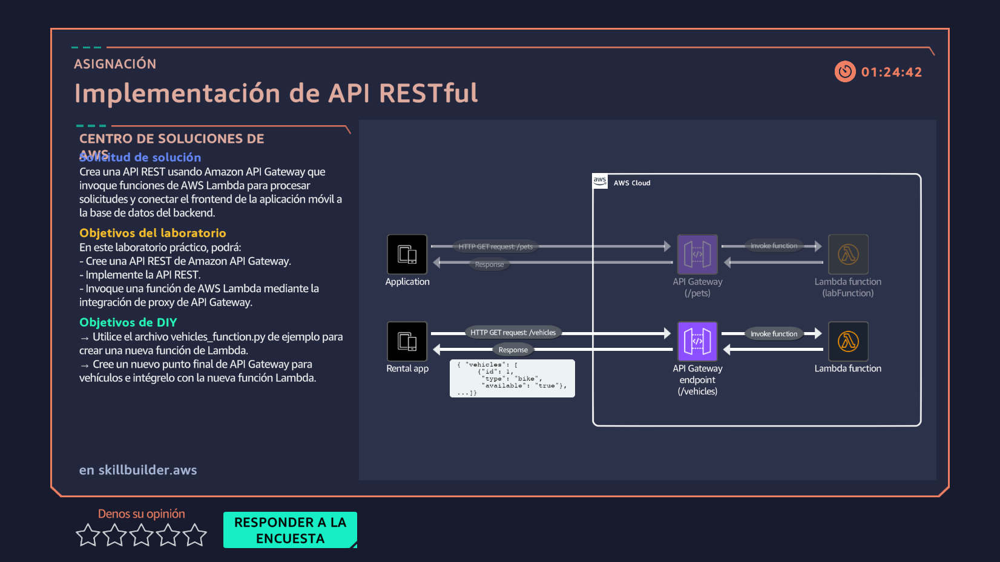
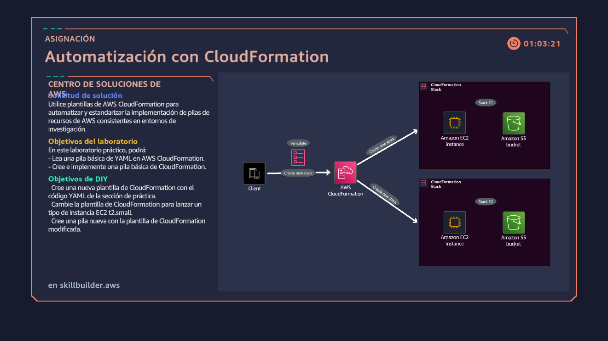
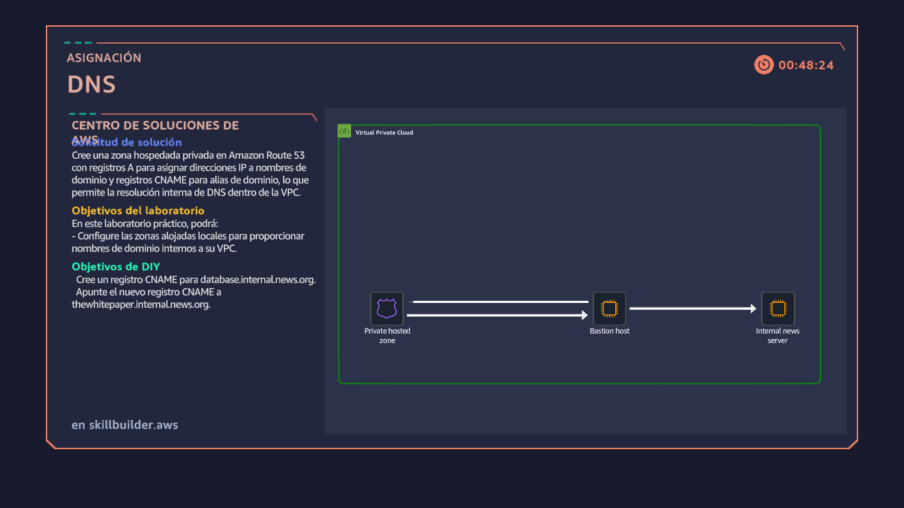
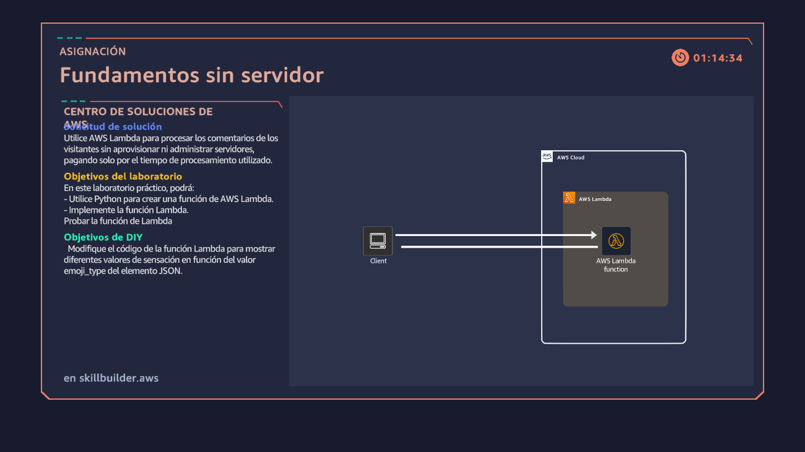
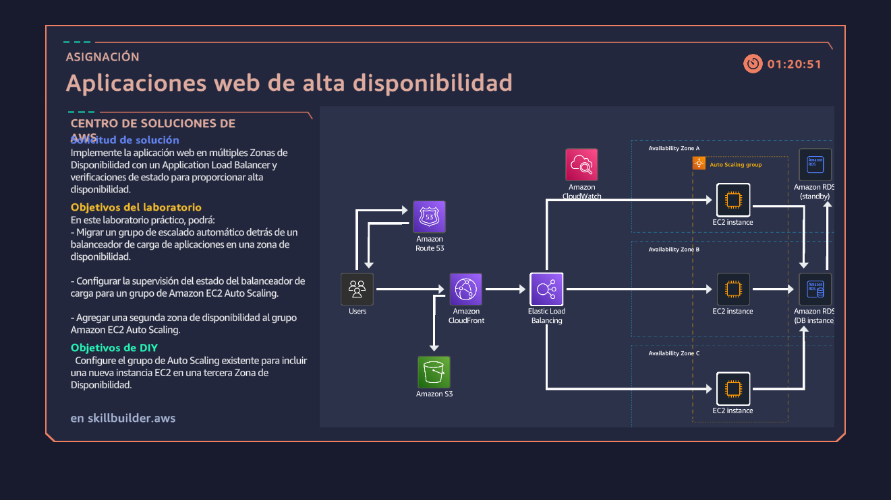

# Ruta Architecting - AWS Solutions Associate

Este repositorio contiene los laboratorios prácticos para la ruta de certificación de **AWS Solutions Architect Associate**. A través de estos ejercicios, aprenderás a implementar soluciones arquitectónicas en la nube de AWS, desde servicios serverless hasta arquitecturas de alta disponibilidad.

## Resumen

Los laboratorios están diseñados para proporcionarte experiencia práctica con los servicios más importantes de AWS, incluyendo:

- **Serverless**: Implementación de funciones Lambda y API Gateway
- **Infraestructura como Código**: Automatización con CloudFormation
- **Redes**: Configuración de DNS privado con Route 53
- **Alta Disponibilidad**: Balanceadores de carga, Auto Scaling y múltiples AZs

Cada laboratorio incluye un caso de uso real, diagramas de arquitectura, pasos detallados e información sobre los conceptos clave y servicios AWS involucrados.

---

## Índice de Laboratorios

| # | Laboratorio | Caso de Uso | Servicios Principales |
|---|---|---|---|
| 1 | [API Restful](#laboratorio-api-restful) | Aplicación mobile para rentar y ubicar scooters en un parque de diversiones | API Gateway, Lambda, DynamoDB/RDS |
| 2 | [CloudFormation](#laboratorio-automatización-cloudformation) | Automatización del aprovisionamiento de infraestructura | CloudFormation, EC2, S3, Security Groups |
| 3 | [DNS](#laboratorio-dns-con-route-53) | Servidor interno de noticias para empleados con acceso DNS privado | Route 53, EC2, VPC |
| 4 | [Serverless](#laboratorio-fundamentos-serverless) | Sistema de recopilación de comentarios y calificaciones de visitantes | Lambda, CloudWatch, S3, DynamoDB, API Gateway |
| 5 | [Alta Disponibilidad](#laboratorio-alta-disponibilidad-web) | Aplicación web de agencia de viajes distribuida en múltiples AZ | ALB, Auto Scaling, EC2, CloudWatch, CloudFront |

---

## Laboratorios Detallados

### Laboratorio API Restful

**Caso de Uso**: Aplicación para un parque de diversiones que permite a los clientes rentar y ubicar scooters eléctricos dentro del parque.

**Descripción**: 
Este laboratorio cubre la implementación de una API RESTful utilizando Amazon API Gateway y AWS Lambda. Conectas el frontend (interfaz de usuario) con el backend (base de datos) mediante integración proxy de Lambda. Aprenderás cómo diseñar una arquitectura serverless escalable que permita que miles de clientes simultáneamente consulten disponibilidad de vehículos.

**Servicios AWS**: API Gateway, Lambda, DynamoDB/RDS

**Conceptos Clave**:
- API RESTful y sus principios arquitectónicos (métodos GET, POST, PUT, DELETE)
- Amazon API Gateway como puerta de entrada gestionada
- Integración proxy de Lambda
- Stages y control de versiones de API
- Comunicación stateless entre frontend y backend
- Escalabilidad automática sin gestionar servidores

**Imagen de Referencia**:

**Recursos Adicionales**:
- [Documentación oficial de API Gateway](https://docs.aws.amazon.com/apigateway/latest/developerguide/welcome.html)
- [Documentación de AWS Lambda](https://docs.aws.amazon.com/lambda/latest/dg/welcome.html)
- [Integración Lambda con API Gateway](https://docs.aws.amazon.com/apigateway/latest/developerguide/api-gateway-lambda-function-handler.html)

---

### Laboratorio Automatización CloudFormation

**Caso de Uso**: Automatización del aprovisionamiento de infraestructura creando stacks de recursos de AWS de forma repetible y controlada por versiones.

**Descripción**:
Aprende a modelar y aprovisionar recursos de AWS utilizando plantillas de CloudFormation en formato YAML o JSON. Creas una EC2, un grupo de seguridad y un bucket S3 de forma automatizada. Este laboratorio te muestra cómo tratar la infraestructura como código, permitiendo versionado, reutilización y despliegues consistentes.

**Servicios AWS**: CloudFormation, EC2, S3, Security Groups

**Conceptos Clave**:
- Infraestructura como Código (IaC)
- Plantillas de CloudFormation (YAML/JSON)
- Recursos de AWS: EC2, Security Groups, S3
- Referencias entre recursos con !Ref
- Stacks y Control de versiones
- DeletionPolicy y ciclo de vida de recursos
- Reutilización de plantillas

**Imagen de Referencia**:

**Recursos Adicionales**:
- [Documentación oficial de CloudFormation](https://docs.aws.amazon.com/cloudformation/latest/userguide/welcome.html)
- [Crear stacks en CloudFormation](https://docs.aws.amazon.com/cloudformation/latest/userguide/cfn-console-create-stack.html)
- [Mejores prácticas de CloudFormation](https://docs.aws.amazon.com/AWSCloudFormation/latest/UserGuide/best-practices.html)

---

### Laboratorio DNS con Route 53

**Caso de Uso**: Servidor interno de noticias para empleados de una empresa, accesible solo mediante nombres de dominio privados dentro de la VPC.

**Descripción**:
Configura una zona hospedada privada en Amazon Route 53 para resolver nombres de dominio internos. Creas registros A y CNAME para mapear IPs a nombres legibles. Aprenderás cómo implementar un servicio de DNS privado para tu infraestructura sin exponer recursos públicamente a internet.

**Servicios AWS**: Route 53, EC2, VPC

**Conceptos Clave**:
- Amazon Route 53 y zonas hospedadas privadas
- Registros DNS tipo A (mapeo directo IP a dominio)
- Registros DNS tipo CNAME (alias de dominio)
- Servidores Bastion (Jump Host) para acceso seguro
- Resolución DNS interna dentro de VPC
- Nameservers (NS) y registros SOA
- Patrones de arquitectura seguros

**Imagen de Referencia**:

**Recursos Adicionales**:
- [Documentación oficial de Route 53](https://docs.aws.amazon.com/route53/latest/developerguide/Welcome.html)
- [Trabajar con Hosted Zones](https://docs.aws.amazon.com/route53/latest/developerguide/hosted-zones-working-with.html)
- [Tipos de registros DNS](https://docs.aws.amazon.com/route53/latest/developerguide/ResourceRecordTypes.html)

---

### Laboratorio Fundamentos Serverless

**Caso de Uso**: Sistema de recopilación de comentarios y calificaciones de visitantes de un parque de diversiones, sin necesidad de gestionar servidores.

**Descripción**:
Implementa una función Lambda que procesa comentarios de clientes. Aprende sobre el paradigma serverless y los servicios adicionales de la plataforma AWS serverless. Descubre cómo construir soluciones escalables que se adapten automáticamente a la demanda sin mantenimiento operativo.

**Servicios AWS**: Lambda, CloudWatch, S3, DynamoDB, API Gateway, SNS, SQS, EventBridge, Step Functions

**Conceptos Clave**:
- AWS Lambda y funciones serverless
- Paradigma "no servers to manage"
- Triggers y tipos de invocación (síncrona/asíncrona)
- Plataforma serverless AWS (S3, DynamoDB, API Gateway, SNS, SQS)
- CloudWatch para logs y monitoreo
- Escalabilidad automática y metering por milisegundos
- Concurrencia y reserva de capacidad
- Roles de ejecución de IAM

**Imagen de Referencia**:

**Recursos Adicionales**:
- [Documentación oficial de Lambda](https://docs.aws.amazon.com/lambda/latest/dg/welcome.html)
- [Invocación de Lambda](https://docs.aws.amazon.com/lambda/latest/dg/lambda-invocation.html)
- [CloudWatch Logs](https://docs.aws.amazon.com/cloudwatch/latest/logs/WhatIsCloudWatchLogs.html)

---

### Laboratorio Alta Disponibilidad Web

**Caso de Uso**: Aplicación web de agencia de viajes desplegada en múltiples zonas de disponibilidad con balanceo de carga y auto escalado.

**Descripción**:
Configura una arquitectura de alta disponibilidad utilizando Application Load Balancer, Auto Scaling Groups y verificaciones de estado. La app se despliega en múltiples AZs para garantizar redundancia y disponibilidad continua. Aprenderás cómo diseñar sistemas que permanecen operativos incluso ante fallos de infraestructura.

**Servicios AWS**: ELB/ALB, Auto Scaling, EC2, CloudWatch, CloudFront

**Conceptos Clave**:
- Amazon Application Load Balancer (ALB)
- Auto Scaling Groups y políticas de escalado
- Health checks y verificación de estado
- Múltiples Zonas de Disponibilidad (AZ)
- Amazon CloudFront para CDN y distribución global
- Target Groups y routing
- Listener y reglas de enrutamiento
- Redundancia y tolerancia a fallos

**Imagen de Referencia**:

**Recursos Adicionales**:
- [Documentación de Elastic Load Balancing](https://docs.aws.amazon.com/elasticloadbalancing/latest/application/introduction.html)
- [Auto Scaling para EC2](https://docs.aws.amazon.com/autoscaling/ec2/userguide/what-is-amazon-ec2-auto-scaling.html)
- [Zonas de Disponibilidad](https://docs.aws.amazon.com/AWSEC2/latest/UserGuide/using-regions-availability-zones.html)

---

## Requisitos del Workshop

Para completar estos laboratorios, necesitarás configurar tu entorno de desarrollo. Elige una de las siguientes opciones:

### Opción 1: Consola AWS (Recomendado para principiantes)
- Una cuenta de AWS activa
- Acceso a la consola de gestión de AWS
- Permisos suficientes para crear recursos (EC2, Lambda, API Gateway, etc.)

### Opción 2: Entorno de Desarrollo Local
- **Editor de código recomendado**: VS Code
- **AWS CLI** instalado y configurado
- **AWS Toolkit** para VS Code (opcional)
- **CloudFormation Linter** para validar plantillas YAML/JSON

### Requisitos específicos por laboratorio

| Laboratorio | Servicios Requeridos | Nivel de Dificultad | Tiempo Estimado |
|---|---|---|---|
| API Restful | API Gateway, Lambda, DynamoDB | Intermedio | 1-2 horas |
| CloudFormation | CloudFormation, EC2, S3 | Principiante | 1 hora |
| DNS | Route 53, EC2, VPC | Intermedio | 1-2 horas |
| Serverless | Lambda, CloudWatch | Principiante | 45-60 min |
| Alta Disponibilidad | ALB, Auto Scaling, EC2 | Avanzado | 2-3 horas |

### Recomendaciones

1. **Cuenta AWS**: Si no tienes una, puedes crear una cuenta gratuita con el nivel gratuito de AWS (Free Tier) en [aws.amazon.com/free](https://aws.amazon.com/free)

2. **Región**: Se recomienda usar `us-east-1` (N. Virginia) para la mayoría de los laboratorios, ya que tiene mayor disponibilidad de servicios.

3. **Plugin recomendado**: Instala el plugin **CloudFormation Linter** en tu editor de código para validar plantillas YAML/JSON antes del despliegue.

4. **Costos**: Algunos servicios pueden generar costos menores. Consulta la [calculadora de precios de AWS](https://calculator.aws/) antes de comenzar y establece alertas de presupuesto.

5. **Limpieza**: Al finalizar cada laboratorio, elimina los recursos creados para evitar cargos adicionales innecesarios.

6. **Orden recomendado**: Comienza con CloudFormation y Serverless (más sencillos), luego DNS y API Restful (intermedios), finalmente Alta Disponibilidad (avanzado).

### Recursos Adicionales Generales

- [Documentación oficial de AWS](https://docs.aws.amazon.com)
- [AWS Training and Certification](https://aws.amazon.com/training/)
- [AWS Free Tier](https://aws.amazon.com/free)
- [AWS Architecture Center](https://aws.amazon.com/architecture/)
- [Well-Architected Framework](https://aws.amazon.com/architecture/well-architected/)
- [AWS Solutions Architect Associate - Guía de estudio](https://aws.amazon.com/certification/certified-solutions-architect-associate/)

---

*¡Buena suerte en tu aprendizaje de AWS!* 🚀
